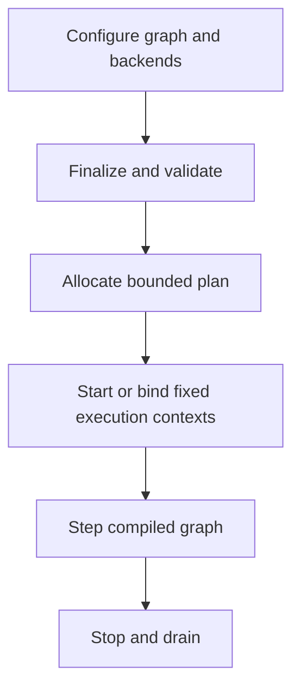

# Architecture

M21-05 closes the existing M21 transport without adding an execution lane.
M22-01 adds the separate data-only live-control staging surface. M22-02 adds a
bounded frame-owner scan, deterministic replacement/order, inactive/active
immutable generation storage, callback-local views, terminal slot reclamation,
and fixed inspection. M22-03 adds a third step-entry generation, provisional
slot ownership, a direct-index action ring, retained replay journal, fixed
checkpoint scratch, and exact-boundary replay injection. It adds no lane,
payload parser, implicit backend transfer, or telemetry exporter.
M22-04 adds only a header-instantiated source layer above the public raw record:
caller storage holds a fixed canonical envelope/body, compile-time application
codecs perform bounded field encoding, and builders return an ordinary
`LiveControlUpdateRecord`. No Runtime object, lane, provider region, registry,
global cursor, compiled symbol, or destructor operation is added.
See [live_controls.md](live_controls.md).

The merged M21 closure remains:
sampled descriptor, validated fixed frame, cross-rate snapshot/device slot,
terminal completion, then one closed logical action. Conditional checkpoint
state and the separate active-replay artifact preserve exact logical decisions
for deterministic mock/loopback re-execution. See
[sampled_io.md](sampled_io.md) and
[determinism_replay.md](determinism_replay.md).

This page separates the supported 1.2 target runtime from compatibility and
candidate paths. The normative contract is the
[product contract](product_contract.md); the decisions behind it are recorded
in [ADRs](adr/README.md).

## Current 1.2 implementation

### Target host, device, distribution, SDK, policy, and rate-model runtime

`rt::Runtime` is the first target-path component. It owns a strict
configure/finalize/start/step/stop state machine, a finalization-time graph
compiler, frozen phase/resource topology, a finalized aligned scratch/queue/
trace memory plan, a runtime-local clock, an explicit numerical helper policy,
one runtime-owned or borrowed host CPU executor, optional
watchdog/degradation state, and a
fixed-capacity platform-preflight report.

M21-01 adds one finalization-only device-rate compiler beside the M16 timeline
and dispatch compilers. Configuration stores a phase/domain association,
positive completion budget, positive per-phase in-flight bound, and one role
per flattened M17 buffer reference. Finalization reads the already copied
command batch and backend capability/topology snapshots, publishes immutable
inspection records, and simulates one exact repeating supercycle with
half-open completion intervals. CPU admission remains one conservative lane;
device demand is checked independently per phase, backend, Runtime, and poll
boundary, including previous-cycle carry.

The compiler introduces no execution lane. Reference-only `step()` retains
ordinary graph behavior. M21-02 extends the immutable active plan with direct
device-reference and dependency slices plus preallocated completion tickets.
An active provider runs once through the existing executor, copies its batch
and exact release identity into an existing device slot, and releases the
executor phase after enqueue. Existing per-backend submission and service
lanes own vendor submit/poll/timeout cancellation. Independent records in one
release group may overlap; dependency and group barriers consume exact tickets
before advancing. Vendor-owned timeouts are quarantined from reuse until
checked backend shutdown.

M21-03 compiles one direct device endpoint per CPU/device cross-rate channel.
The endpoint derives its buffer envelope, role, access, timestamp domain, and
slot count from M21-01 and maps each deterministic release-slot ordinal to a
disjoint host-coherent subrange. CPU input copy precedes provider invocation;
device output capture follows terminal success while the M21-02 ticket remains
owned. The same packed-atomic SPSC store remains the publication boundary, and
no copy lane, vendor call, mutex, or active registry scan is added.

M21-04 layers sampled descriptors, strict frame validation, selection policy,
and acknowledged safe outputs on those endpoints. M21-05 freezes a semantic
closure policy and allocates one direct-index action ring plus replay/checkpoint
controls. Runtime emits settled rate, device, sampled, safety, watchdog, and
stop results; action loss is explicit and disqualifies replay. A quiescent
active artifact binds a checkpoint, caller-owned input records, and the
gap-free transcript. Replay prevalidates the complete artifact, restores once,
drives recorded logical choices, re-runs deterministic providers/backends, and
compares every generated action and content identity. It never treats physical
arrival order or live watchdog time as replay input.

M22-01 finalization constructs one optional `LiveControlMailboxSet` after the
rate plan is compiled and before Runtime state is published. The set copies
compiled release identities, owns fixed mailbox/producer/slot/payload storage,
and contributes exact logical control extents. External producers address one
pre-registered producer directly through a Runtime-generation handle. A
release-store publishes only a complete descriptor and copied payload. M22-02
adds fixed candidate and double-generation stores. The frame owner closes one
exact target without waiting on producers, copies canonical survivors into the
inactive generation, and publishes it before existing callbacks. M22-03 keeps
source slots provisional through the owning step and restores the step-entry
generation on failure. Its separate action records never contain payload bytes;
only an explicit caller-requested replay artifact carries retained survivor
payloads. Closure-enabled checkpoint state and replay controls are conditional,
preallocated, and included in the existing Runtime-control ledger. No backend
or watchdog interprets a live-control payload.

Callbacks may decode an M22-04 envelope only as fixed-work validation and copy.
Variable-length parsing, authentication, file/network access, logging, dynamic
allocation, and vendor calls remain application control-plane work outside the
Runtime lane. The helper never stages implicitly, retries, retargets, advances
a producer sequence, or extends Runtime rollback to application/backend/
physical side effects.

M6 replaces the target path's shared trace lock with fixed atomic telemetry
slots. It adds stable event/metric IDs, cumulative and caller-cursor interval
windows, exact trace-sequence loss reporting, and immutable
version/build/config/workload metadata. Export is explicitly a non-RT host
operation; the runtime creates no exporter thread and performs no output I/O.

M7 adds an explicit D0/D1 determinism contract, caller-owned canonical state
registration, bounded versioned checkpoint and input-log artifacts, validated
transactional restore, and synchronous replay. Artifact parsing and runtime
identity checks allocate nothing. D2 reproducible-build and D3 portable
determinism remain unsupported and fail configuration rather than silently
weakening the requested tier.

M8 adds a C-compatible backend ABI, borrowed registered buffers, graph device
phases, a preallocated outstanding table, and one runtime-owned completion
service lane. A command provider runs on the CPU team and returns after bounded
submission. Its graph token remains pending until the poll lane publishes a
completion, so dependent phases are released without parking a compute worker.
The ABI has no completion callback, and stop joins the service lane before
unregistering buffers and shutting down backends. The included deterministic
CPU mock injects saturation, delay, timeout, error, and loss/reset behavior;
it is not a hardware backend.

M9 implements a separate optional CUDA Driver API backend around a host-owned
context and stream set. It pre-creates fixed event slots, supports explicit
copies and fixed-payload kernel launch, integrates through the unchanged M8
ABI, and has a CPU-only injected-driver test suite. It remains a candidate
because no versioned hardware support tuple has passed the required resource,
failure/recovery, and latency gates.

M10 adds a separate Xilinx XDMA AXI-MM character-device candidate for the
named upstream Linux driver stack. Blocking character-device I/O is confined
to a fixed initialization-time worker team; the M8-facing submit and poll
paths remain bounded. Its injected-driver tests cover saturation, timeout
quarantine, recovery, concurrency, and steady-state allocation freedom. It
remains unqualified until one declared PCI/driver/bitstream tuple passes the
published hardware evidence gates.

M11 adds the third `host_adapter` executor policy without creating another task
representation. The runtime passes immutable graph/range/reduction records,
aligned scratch, and generation-tagged completion context to a borrowed,
capacity-matched host job system. It also freezes C ABI v8, hides non-C
symbols, checks an exact export allowlist, and validates relocated installed
package consumers. The C++ API remains source-only.

M12 closes the portable RT0 release contract. It names the supported
compiler/OS tuples, adds an independent-device-state concurrency gate, applies
same-major package and target C++ source-compatibility policy, and checks
strict CPack staging plus content-addressed package and hardware-evidence
manifests. These gates do not promote RT1, RT2, CUDA, or XDMA qualification.

M15-01 added the policy/resource model, and M15-02 added native runtime-owned
thread application/readback behind a held startup gate. M15-03 adds one copied,
size/versioned provider table with acquire/apply/observe/rollback/release
callbacks. It can back exactly phase scratch, task scratch, and trace storage.
Finalization acquires active regions in that order and constructs executor and
telemetry owners in validated usable spans. Startup applies and observes memory
before the thread gate. Strict failure and later thread/device-start failure
quiesce lanes and reverse memory operations; checked stop destroys owners and
releases provider tokens in reverse order.
Live tokens and allocation extents are registered across runtime instances so
a shared provider cannot alias ownership or storage between runtimes.

The default path retains aligned-new behavior. Linux page policy uses
process-local `mmap` with rounded inaccessible guards and aligned usable bases,
an explicit `MAP_HUGETLB` attempt with requested fallback, caller/prefault page
touch, `mlock`, and `mincore` residency observation. Locking-only allocations
are page-backed independently so page-granular unlock cannot affect another
runtime. `mlock` is not independent lock readback or device/DMA pinning. Caller,
host-adapter, XDMA, and vendor
roles remain verify-only, with opaque cardinality left unknown unless declared.
Stable memory rows still project the plan exactly once. M15-04 inventories
constructed runtime, executor, and device controls as checked non-overlapping
logical extents; aggregates live runtime-owned stack commitment; and accepts
bounded copied declarations for otherwise opaque external/backend facts.
Logical, declared, committed, resident, locked, pinned, and guard facts remain
separate. See the
[CPU/memory policy contract](cpu_memory_policy.md).

M16-01 adds a finalization-only timeline compiler beside the graph compiler.
Copied rate-domain and binding declarations are validated against the
instance-owned graph, then compiled into fixed domain/binding records and an
epoch-zero `[0, lcm)` release vector. The compiler uses checked integer
arithmetic and deterministic registration/compiled-phase/substep ordering.
All storage remains runtime-owned and is counted within the existing runtime-
control extent. Reference-only execution retains complete-graph once-per-frame
behavior.

M16-02 compiles a second immutable layer over that vector. A copied channel
connects one CPU producer and one CPU consumer in different explicit domains.
For every consumer reference release the compiler selects the latest strictly
earlier reference-order producer twice: once for the first supercycle and once
for repeating steady state. The latter represents wrap with cycle offset `-1`;
the former uses copied initial bytes when no producer is eligible. Exact age,
held provenance, and freshness are metadata only. Each channel also owns a
two-slot packed-atomic SPSC store whose payload becomes visible only after a
release publication and cannot be copied while the producer owns the slot.

M16-03 adds a finalization-only active dispatch compiler after those immutable
plans. The opt-in policy admits only D0 mandatory CPU records on one
conservative serialized declared-budget lane, groups reference records by
atomic domain release, and rejects cross-domain ordinary dependencies. During
an active step, the host thread maps a checked logical window to a contiguous
nominal epoch, evaluates one bounded late action per group, and sends selected
phase records serially through the existing executor. There is no added worker
pool or service lane. Producer bytes stage until all required publications are
complete, then enter the exact-generation stores; hold preserves the current
alias. Cursor, fault, alias, generation, and payload state remains runtime-
owned and participates in generic checkpoint state.

M16-04 extends that compiler with optional CPU groups while preserving
mandatory-only admission. A runtime-owned policy state tracks bounded
late/on-time streaks and a deterministic shed bitset/order. Only settled
mandatory releases update it; one threshold crossing changes one optional
domain, immediately affecting the next total-order release. Optional channel
endpoints remain invalid. The conditional checkpoint tail retains this state
without changing the schema-1 codec or mandatory-only bytes.

A separate `rate_telemetry` component owns a fixed-capacity atomic record ring
and fixed counter bank. It publishes one nonblocking attempt per action/range,
reports overwrite/contention/zero-capacity loss, and exposes only non-RT
runtime-bound cursor inspection. It is deliberately separate from global
observability schema 2 and from checkpoint/replay artifacts.

M17-01 inserts one versioned HAL v2 core boundary between device registration
and the existing device manager. Native v2 registrations copy the public table
directly. Device-ABI-v1 registrations create exactly one separately allocated,
Runtime-owned compatibility object; the manager then sees only its HAL v2
table. This keeps adapter self pointers stable across configuring-vector growth
and confines every direct v1 call and field translation to `hal_v2.cpp`.

The canonical manager retains its fixed outstanding and completion storage,
submitting/early-ready handshake, single poll lane, graph-token release, health
and reset surface, and reverse retryable cleanup. Adapter objects and v1 poll
scratch are device-control extents, while borrowed instances, buffers, and
backend-private bytes remain outside owned plan rows. Adapted v1 follows the
legacy identity byte path; only native v2 adds a kind/API marker. No memory
domain, batch, timeline, vendor-control, plugin, or new-lane architecture is
introduced by M17-01.

M17-02 appends one separately versioned memory/topology extension pointer to a
native HAL v2 registration. Configuring-time discovery copies a bounded
snapshot of memory domains, topology nodes and directed links, timestamp
domains, and the completion timestamp-domain choice. A native extension and
its snapshot are validated transactionally before publication. A core-only v2
or adapted-v1 backend instead receives one synthetic borrowed-host,
host-coherent, no-sync domain so the legacy path remains semantically exact.

Explicit heterogeneous-memory declarations bind one same-instance domain to
either a host span or an opaque handle. Start registers those declarations in
forward order and checked stop unregisters them in reverse order before backend
shutdown. Native tokens and ownership-uncertain failures remain in fixed
instance-local state for retry. Read-only Runtime inspectors expose copied
semantic records; a bounded running-state control call performs declared
timestamp-domain correlation. None of those paths creates a scheduler lane,
changes runtime monotonic time, or extends global observability schema 2. See
the [heterogeneous-memory contract](heterogeneous_memory.md).

Host-driven `step()` receives frame index, simulation delta, and an optional
deadline. It waits synchronously without pacing while dependency-ready phases
run on static-assignment, bounded-throughput, or borrowed-host policy.
Finalization
rejects invalid/foreign handles, cycles, unordered conflicting resource access,
an undersized graph queue plan, task-scratch underprovisioning, and a plan over
the configured memory budget. Nested ranges and deterministic-tree reductions
use the same executor.

Finite self-paced `run_periodic()` uses absolute epoch-based releases on the
calling frame thread and reports release, wake, start, finish, slack, deadline
miss, watchdog, and degradation data. A configured watchdog has one service
lane but never invokes host code; the frame thread applies degradation after
the graph returns. Optional strict Linux preflight is read-only and runs before
runtime threads start. See the
[time/platform contract](time_platform.md).

Stable C ABI v8 mirrors this lifecycle with size/version-checked structures,
an explicit compatibility handshake, and encoded graph handles. See the
[C ABI contract](c_abi.md), the
[host runtime contract](host_runtime.md) and
[compiled graph contract](compiled_graph.md), the
[executor contract](executor.md), and the
[memory-plan contract](memory_plan.md), the
[observability contract](observability.md), and the
[determinism/replay contract](determinism_replay.md), and the
[device backend contract](device_backend.md).

### Legacy simulation path

`SimCore` owns a phase graph, an internal range-worker team, frame arenas,
metrics hooks, tracing, pacing, adaptation, snapshots, and a separate
`FiberPool`. It creates worker threads in its constructor and `run()` owns a
self-paced loop.

Phases are grouped into topological levels. Dependencies order those levels,
while enabled phases in one level may run concurrently. A phase can contain:

- serial callbacks;
- chunked range callbacks;
- ordinary reductions;
- deterministic range reductions.

The demo exercises independent input, physics, AI, and audio work followed by
dependent constraint, integration, and telemetry phases.

### Important limitations

- `buildTopoLevels()` does not report a cycle as a configuration error.
- `SimCore`, `WorkerPool`, `rt::Scheduler`, and `FiberPool` remain compatibility
  experiments with different task and lifetime rules. `rt::Runtime` does not
  invoke them.
- `WorkerPool` has one bounded global FIFO queue. Its normal dequeue path does
  not honor `Job::priority`; its “steal” counter measures unsuccessful polling
  while work is outstanding, not successful cross-worker steals.
- `SimCore::run()` sleeps and advances its own wall-clock schedule, so it is
  not yet suitable as a host-driven engine step.
- construction and some running paths allocate, lock, perform file I/O, or
  create threads. The frame arena can use heap fallback after Release overflow.
- legacy global trace and floating-point state prevent clean isolation of
  multiple `SimCore` instances. The M1 `rt::Runtime` does not use those globals.
- the legacy HAL memory flags are no-ops, and its GPU path is a detached
  CPU-thread mock outside `rt::Runtime`.

These are tracked in the [roadmap](roadmap.md), not hidden behind feature
claims.

## Target architecture

The complete target lifecycle is configure, finalize, start, run, and stop:

Finalization compiles phase dependencies and resource hazards into an immutable
execution plan. One executor boundary runs CPU work under a selected policy.
Device backends receive bounded submissions and publish completions; CPU
workers do not block on device futures.

M1 implements the state machine and host-driven callback path. M2 compiles and
freezes dependency/resource topology. M3 creates the fixed team in `start()`
and routes graph and nested CPU work through it. M4 creates the finalized
memory plan, aligned execution-context scratch, and bounded frame-overload
policy. M5 adds the distinct absolute-release loop, one-shot watchdog with
frame-thread degradation, and fail-closed prerequisite reporting. M6 adds
bounded schema-v1 trace/counter emission and isolated non-RT export cursors.
M7 adds D1 schedule-independent identity, canonical registered state, bounded
checkpoint/input-log codecs, transactional restore, and synchronous replay.
M8 adds the poll-only device ABI, graph-held device completion tokens,
preallocated device-manager storage, and deterministic mock.
M9 adds the optional CUDA candidate without coupling the scheduler to vendor
headers or changing the portable device contract. M10 adds the optional Linux
XDMA AXI-MM candidate, likewise behind the unchanged M8 contract and a separate
support matrix.
M11 adds the borrowed host job-system policy and stable distribution boundary.
M12 names the portable RT0 support tuples and makes the 1.x compatibility,
release archive, digest-manifest, and independent-device-isolation gates
machine-verifiable.
M15-02 extends the immutable CPU/memory inventory with per-role native thread
apply/readback and a fail-closed startup barrier. M15-03 adds the isolated
three-region memory transaction without changing the C or device ABI. Provider
callbacks remain control-path-only; provider-backed checked stop makes trace
unavailable after its backing token is released. M15-04 adds exact
control-ledger reconciliation, live stack observation, and owning-lane stack
cleanup before join. Cleanup proceeds from device ownership through device
service, reverse executor instances, watchdog, fragmented controls, and
trace/task/phase rollback while retaining the first error and every unresolved
owner.
M16-01 adds the bounded reference-plan compiler. M16-02 adds cross-rate
selection and snapshot-store construction. M16-03 adds opt-in active admission,
selected CPU dispatch, transfer, and late actions. M16-04 adds optional CPU
shedding/recovery and a separate versioned per-release telemetry component
without adding a lane or provider region. M17-01 adds the HAL v2 core boundary
and complete device-ABI-v1 compatibility adapter while retaining the same
manager and service lane. M17-02 adds pre-start heterogeneous-memory and
topology state, native memory-token cleanup, and non-RT inspection/correlation
while retaining that same manager and service lane.
See the [determinism/replay contract](determinism_replay.md),
[device backend contract](device_backend.md),
[HAL v2 contract](hal_v2.md),
[heterogeneous-memory contract](heterogeneous_memory.md),
[CUDA backend contract](cuda_backend.md),
[XDMA backend contract](xdma_backend.md),
[ADR-0001](adr/0001-one-executor-boundary.md),
[ADR-0002](adr/0002-host-driven-time.md), and
[ADR-0003](adr/0003-device-backend-boundary.md), and the
[runtime profile contract](runtime_profiles.md).

## Memory layout utilities

The repository includes SoA/AoSoA containers and SIMD-oriented kernels. They
are optional utilities, not a required application data model and not evidence
that arbitrary host data is automatically optimized.

## Code anchors

- M1–M14 host/device runtime and 1.2.1 lifecycle-safety closure:
  `rt::Runtime`; `rt/include/rt/runtime.hpp`,
  `rt/src/host_runtime.cpp`
- M2 graph compiler: `rt/src/compiled_graph.cpp`
- M3 executor: `rt/src/executor.cpp`
- M11 host adapter and stable distribution: `rt/src/executor.cpp`,
  `rt/include/rt/c_api.h`, `docs/c_abi.md`, `tests/package_consumer`
- M12 portable release contract: `docs/portable_support_matrix.json`,
  `docs/release_policy.md`, `release/rtfw-release-contract.json`,
  `tools/check_release_contract.py`, `tools/stage_release_artifacts.py`,
  `tools/extract_release_archive.py`, `tools/release_manifest.py`,
  `tools/check_hardware_evidence.py`,
  `tests/test_release_tools.py`, `.github/workflows/release.yml`
- M13 runtime profiles/autotune: `rt/include/rt/profile.hpp`,
  `rt/src/runtime_profile.cpp`, `src/runtime_profile_demo.cpp`,
  `tools/autotune/config.schema.json`, `tools/autotune/spec.yaml`,
  `docs/runtime_profiles.md`
- M14 SDK/package boundary: `rtfw::runtime`, `rt/include/rt/config.hpp`,
  `rt/include/rt/status.hpp`, `rt/include/rt/canonical_bytes.hpp`,
  `cmake/rtfwConfig.cmake.in`, `tests/package_consumer/package_contract.cmake`
- M15-01 policy model/inventory: `rt/include/rt/config.hpp`,
  `rt/include/rt/runtime.hpp`, `rt/src/resource_policy.cpp`,
  `docs/cpu_memory_policy.md`, `tests/test_cpu_memory_policy.cpp`
- M15-03 resident-region transaction: `rt/src/memory_policy.cpp`,
  `rt/src/memory_policy.hpp`, `tests/test_memory_policy.cpp`
- M4 memory plan: `rt/src/aligned_storage.hpp`,
  `docs/memory_plan.md`
- M5 time/platform controls: `rt/src/watchdog_monitor.cpp`,
  `rt/src/native_platform_preflight.cpp`, `docs/time_platform.md`
- M6 observability: `rt/src/telemetry.cpp`,
  `rt/src/observability_export.cpp`, `docs/observability.md`
- M7 determinism/replay: `rt/src/snapshot_codec.cpp`,
  `docs/determinism_replay.md`
- M8 device ABI/manager/mock: `rt/include/rt/device_abi.h`,
  `rt/src/device_manager.cpp`, `rt/src/mock_device.cpp`,
  `docs/device_backend.md`
- M9 CUDA candidate: `rt/include/rt/cuda_backend.hpp`,
  `rt/src/cuda_backend.cpp`, `rt/src/cuda_driver.cpp`,
  `docs/cuda_backend.md`
- M10 XDMA candidate: `rt/include/rt/xdma_backend.hpp`,
  `rt/include/rt/xdma_linux.hpp`, `rt/src/xdma_backend.cpp`,
  `rt/src/xdma_linux.cpp`, `docs/xdma_backend.md`
- Stable C lifecycle ABI: `rt/include/rt/c_api.h`, `src/c_abi.cpp`
- Phase registration and graph: `SimCore::addPhase`,
  `SimCore::addDependency`, `SimCore::buildTopoLevels`;
  `include/simcore/SimCore.hpp`
- Internal range execution: `SimCore::initThreads`,
  `SimCore::executeFrame`; `include/simcore/SimCore.hpp`
- Optional global-queue pool: `WorkerPool`; `include/simcore/worker_pool.hpp`
- Separate research scheduler: `rt::Scheduler`; `rt/include/rt/scheduler.hpp`
- Data-layout utilities: `include/simcore/car_soa.hpp`,
  `include/simcore/soa/`

## M17-03 command and timeline lanes

Configuration copies one version-1 command/timeline extension, up to 16
timeline descriptors per opted-in backend, and batch-phase declaration
skeletons. Finalization constructs fixed slots, timeline atomics, completion
scratch, and exactly one submission thread for each opted-in backend.
Core-only-v2, memory-only-v2, and adapted-v1 backends create no such thread.

The ordinary executor runs the provider and performs bounded validation and
copy only. The per-backend lane serializes potentially blocking submit calls;
the existing service lane alone polls completions. Accepted-before-complete
state transitions support early completion, whole-poll validation, exact-once
graph release, timeout/cancel, and stop-request unblocking. Stop joins
submission lanes in reverse order before service, memory, and backend cleanup.
There is no cross-backend timeline, hidden synchronization, direct peer DMA,
device-rate execution, or new plugin/factory ownership.

## M17-04 native vendor command adapters

The existing CUDA and XDMA candidate objects can expose borrowed native HAL-v2
registrations without changing their device-ABI-v1 tables. Each object owns one
fixed core, memory/topology, and command/timeline table set and rejects a second
registration path or invalid lifetime. Runtime continues to own the single
M17-03 submission lane; vendor callbacks do not move to executor workers.

CUDA stores at most 16 caller-owned, pre-instantiated Graph handles with stable
16-bit identifiers and copied bindings. One native batch preserves declared
copy/kernel/Graph order on one configured stream and records one completion
event. XDMA uses the existing fixed I/O team for H2C/C2H, bounded 32-bit user-
BAR operations, and stop-aware event waits. Both adapters retain uncertain
ownership through drain or checked shutdown; neither adds a cross-backend
timeline, combined execution, or hardware qualification.

M17-05 review found that these native command tables were not reachable through
canonical Runtime registration because Runtime cleared the capability input
header. M17-06 repairs only that Runtime-owned initialization: the callback
receives exact size/version defaults and zero semantic/reserved fields, then
the complete returned record is still validated before publication. Both
actual candidates now register in one canonical Runtime without a wrapper or
vendor callback change.

The M17-06 portable graph contains five ordinary dependency phases: CPU
prepare, simulated CUDA batch, CPU host-stage bridge, simulated XDMA batch, and
CPU validation. CUDA upload/Graph/download and XDMA H2C/control/event/C2H are
ordered inside their own fixed batches. Each backend owns a distinct local
timeline. The only cross-backend edge is successful CUDA download followed by
a bounded byte copy between disjoint host regions; no memory registration,
timeline value, fence, coherency promise, or peer path crosses the boundary.

## M18-01 offline qualification plane

Qualification files are outside every runtime lane and package surface. A
separately retained plan supplies the immutable tuple, policy, workload, trial,
and threshold intent. A record binds its exact bytes, repeats observed identity,
retains a complete artifact manifest and raw-population references, and records
recomputed trial/threshold results. A separate review binds the exact plan,
record, and manifest digests. Only that complete set can produce a canonical
`proposal_only` handoff.

The validator uses bounded strict JSON parsing and streaming artifact hashing.
It follows no symlink, accepts no unlisted artifact, starts no thread or device
work, and writes only one explicit new output through atomic non-overwriting
publication. It has no support-matrix, Git, remote, signing, or production
mutation path. See [the qualification contract](qualification.md).

This plane is not a scheduler or HAL capability. M17-06's portable simulated
composition does not itself satisfy the unchanged M18-01 non-synthetic
promotion policy; physical combined promotion remains fail closed.

## M19-01 extension transaction and ownership

The host calls one already-resolved C entry function while Runtime is
configuring. Staging callbacks write only a fixed transaction record. After
version, prefix, name, reserved-field, capacity, handle, relationship, device
capability, and graph validation, prepared Runtime vectors are swapped in one
nonthrowing commit. Each failed attempt consumes its provisional generation.

Committed CPU owners feed the ordinary compiled graph. Device owners wrap the
copied device-ABI-v1 table and feed the existing compatibility adapter and
DeviceManager. Service owners have no lane: initialize, status, stop, quiesce,
and shutdown execute synchronously on the serialized host control path. Stop
closes admission before lane cleanup; related services remain borrowed until
backend ownership resolves. Detach clears borrowed callables and retires the
generation. Fixed records are accounted in existing runtime-control bytes,
with canonical DeviceManager bytes remaining in device-control. There is no
loader, module registry, global extension registry, provider region, or native
HAL-v2 capability path.

## M20-PRE-01 portable assurance plane

The portable assurance plane is outside Runtime and the installed SDK. One
shell entry point orchestrates five fail-closed host-tool modes below an
explicit build root: dependency reconciliation, compilation-manifest static
analysis, bounded sanitizer-backed fuzz smoke, candidate artifact verification,
and their cumulative sequence. Checked-in policies identify every admitted
dependency/action, translation unit, seed/dictionary, tool/schema, candidate
artifact, and public fixture input.

The artifact flow is package bytes to deterministic SPDX candidate, then an
unsigned in-toto statement, then an exact expected-source manifest, followed by
offline verification, safe extraction, and relocated consumption. The signed
DSSE fixture is a separate non-target verifier test and never becomes a subject
of the RTFW statement. This plane has no scheduler, lane, runtime callback,
public API, signing, publication, support-promotion, hardware, or Unreal path.

## Optional host-side benchmarks (M23-01)

The M23 benchmark library has no Runtime link edge. Providers are explicitly registered, borrowed, instance-local host-side callbacks; timing/counters are separated from artifact I/O. Canonical schemas and the offline validator form a separate evidence boundary, never a Runtime state input.

See [benchmarking](benchmarking.md) for build, install, provider and artifact contracts.

## CPU benchmarks (M23-02)

M23-02 adds a non-exported CPU fixture library and installed example sources. Only that provider and the CLI link Runtime; the `rtfw::benchmark` dependency boundary remains unchanged. Runtime dies before its borrowed queue, memory and callback owners. Metadata discovery executes no workload or policy operation.
