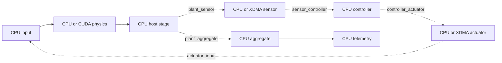

# Golden scenario and lever contract

M26-01 defines the **planned** `rtfw.golden.vehicle.v1` reference. The
[machine-readable contract](../samples/golden_system/contract.json) is frozen
before implementation. The [validator](../tools/check_golden_contract.py) and
[mutation tests](../tests/golden_system/test_contract.py) check its shape,
identities, numerical feasibility, scheduling relationships and claim limits.
They do not run a Runtime scenario, compile the future graph, establish its
actual memory admission or measure performance. M26-02 must demonstrate those
properties through the installed SDK. No golden executable, benchmark result,
package installation change or hardware qualification is delivered here.

This is a vehicle-like integer workload for framework composition, not a
vehicle dynamics model or general physics engine. Its state and codecs belong
to the sample. C ABI v8, SONAME8, device ABI1 and Runtime schemas stay unchanged.
M25 software is merged; its unfamiliar-consumer walkthrough is still unperformed.

## State, numerical identity and ownership

Each independent scenario owns 256 entity slots, with 16 active by default and
three axes per entity. Position, velocity and acceleration are nine int32 SoA
arrays, ordered field/axis/entity. Field offsets are 0, 3072 and 6144 bytes;
the complete plant occupies 9216 bytes, aligned to 64. Command arrays occupy
3072 bytes and the position/velocity sensor snapshot 6144 bytes. Unused entities
remain zero. The JSON also defines aggregate int64 slots and per-instance
logical/control/sample counters. Construct backing storage off lane; never
place the complete host/Runtime arenas on a small callback stack.

Initialization uses the exact unsigned-wrap LCG and axis ordering in the
[M24 model](../samples/cuda_physics/model.hpp): seed1 by default, position within
±1024, velocity within ±64 and initial acceleration within ±4. Per plant tick,
`v_next = v + a`, then `x_next = x + v_next`. Widen to int64 and check narrowing;
no floating point or plant saturation is permitted. Up to1024 ticks give
`abs(v) <= 4160` and `abs(x) <= 2165760`, including arbitrary bounded command
changes. Model units are dimensionless position/tick units; selecting a 10ms
logical base clock does not turn these into calibrated physical units.

The controller uses int64 `gain * (target_velocity - sampled_velocity)`, clamped
to acceleration ±4. Gain defaults to1 with bounds0..4, target velocity defaults
to8 with bounds±64, and calibration is an additive sensor offset default0 with
bounds±16. The worst intermediate is bounded independently of int32 storage.
Configuration values persist in sample-owned latches across new Runtime control
generations; callbacks copy a generation once and never retain its view.

CPU and CUDA must match every active position, velocity and acceleration exactly.
The oracle follows M24's independent closed form on each segment with constant
acknowledged acceleration: `v=v0+n*a`, `x=x0+n*v0+a*n*(n+1)/2`. Split segments
at command changes. Compare the entire state, release counts, status and cleanup;
a checksum alone cannot establish correctness. The contract validator separately
checks signed extremal iterative paths and a weighted-sum piecewise oracle.
Future CUDA substitutes only the physics phase; controls, channels and scenario
identities remain shared. No arbitrary floating-point identity is promised.

## Rates, phases and data flow

The base tick is10,000,000ns. The host advances one base tick per step from logical
epoch zero. The default interval is half-open `[0,24 ticks)`; the six-tick
supercycle contains27 phase-reference records. All baseline domains are mandatory,
substep count1 and late action fail. Budgets are admission estimates, not measured
WCET. The standalone host and independent host-job adapter must use identical
configuration/state oracles; timestamps and physical worker scheduling may differ.

| Registration order / domain | Period in ticks | Budget ns | Phases | Default domain releases |
| --- | ---: | ---: | --- | ---: |
| 0 plant | 1 | 3000000 | input → physics → stage | 24 |
| 1 sensor | 2 | 1000000 | sensor | 12 |
| 2 controller | 3 | 1000000 | controller | 8 |
| 3 actuator | 3 | 1000000 | actuator | 8 |
| 4 observe | 6 | 1000000 | aggregate → telemetry | 4 |

There are108 phase calls over the default interval. Ordinary dependencies exist
only within a domain. The plant input latches prior acknowledged commands,
physics updates disjoint SoA elements, and stage copies completed state into
host-visible channel storage. Aggregation reads its copied channel snapshot and
publishes six axis sums to telemetry. Each named resource lists readers/writers;
every conflicting pair has a dependency path. Separate domains communicate only
through copied channel payloads, not concurrent access to the live plant arrays.

Solid edges are the acyclic phase DAG. Dotted edges are sample-and-hold channels;
feedback selects a preceding reference record and introduces a delay at plant
input. Equal logical times order by domain registration, compiled phase order,
then substep. First-horizon missing producers use explicit initial samples;
repeating horizons select the preceding cycle's final producer. Default maximum
selected ages are0/1/0/3/0 ticks respectively; inclusive channel age limits are
2/3/3/3/6. These semantics follow the [compiled graph](compiled_graph.md) and
[public Runtime registrations](../rt/include/rt/runtime.hpp), not wall-clock races.

Baseline workers are2, with1/2/3 allowed. Nested partitioning has three axis tasks
and entity grains1/4/16/64, default4; at most771 outer/leaf tasks at capacity256.
There are1024 task and queue slots and64 scratch bytes per task. Runtime has a
128MiB budget and sample storage a32MiB cap. These are ceilings requiring actual
MemoryPlan/accounting checks in M26-02, not an assertion that finalization has
already succeeded. Smaller queue/scratch experiments must report rejection and
settle accepted work; no hidden allocation or spill is permitted. Reuse the
[host adapter's ownership rules](host_adapter.md) without modifying that kit.

## Channels, safe outputs and device boundaries

Each channel has an explicit numeric identity26001..26005, fixed256-entity
payload extent, encoding `signed_int32_le`, identity scale/offset, units,
calibration and trigger identities, initial sequence1, one sample per frame,
10ms sample interval and four ring slots. Sensor payloads encode position then
velocity; command payloads encode acceleration, each field/axis/entity ordered.
CPU copies use the same canonical payload geometry with ordinary cross-rate
metadata. Actuator feedback initially carries seeded acceleration; the other
initial payloads are zero. All safety output payloads are zero.

[M21 sampled-I/O](sampled_io.md) registration applies only when exactly one
endpoint is a device. Its existing120-byte frame header carries sequence,
release generation, timestamp/clock/trigger/calibration identities and checksum;
it is not a new sample wire ABI. Callback payload bytes are little endian, but
header ownership/copy rules remain those of the public API. CPU-only operation
does not masquerade as HAL sampled-I/O execution. Sensor calibration control
changes application values only; it never mutates an immutable HAL descriptor.

The simulated XDMA variant replaces sensor and actuator phases. CUDA replaces
physics, whose same-domain completion barrier precedes the CPU stage. All device
channel envelopes are host-visible and explicitly registered, with two admitted
in-flight slots and8ms finite completion timeout. There is no device/device
cross-rate edge or shared CUDA/XDMA timeline. Host staging is explicit; direct
GPU-to-FPGA DMA is outside the contract.

Stale input substitutes its declared initial payload; underrun substitutes safe
output; duplicate publication fails the release. Startup/failure/shutdown output
safety is true only after terminal acknowledgement. Timeout, loss or rejected
safe output leaves safety unknown and invocation failure. Device timestamps use
the declared backend domain and correlation; never subtract unrelated clocks.

## Live controls, checkpoint and recovery

The [M22 typed envelope](live_control_sdk.md) is32 bytes plus a sample-owned16-byte
body. Five schemas (type IDs2601..2605, schema1) carry scenario target velocity,
controller gain, calibration offset, fault selector and clear-fault zero. Fields
are explicit signed32-bit LE words at offset0; remaining words must be zero.
Fault selector0 means none;1..11 maps to the ordered fault inventory. One mailbox
and producer2601 have16 slots,64-byte stride and initial sequence1. Validate body
semantics on the non-RT producer; Runtime remains a payload-opaque transport.

Nominal first-cycle rate controls target input tick1, sensor tick2 and controller
tick3. Resolve all five compiled target coordinates from the finalized plan.
Later-cycle fault/clear controls target host frames12/18; a rate target is one
first-supercycle occurrence and must never be silently retargeted. Different
fault campaigns may stage their controls before their own tick6 injection.
Within a boundary, mailbox/sequence order and same-kind replacement follow
[live_controls.md](live_controls.md). A rejected record does not consume producer
sequence; accepted then replaced records keep their distinct terminal outcomes.

The sample pairs a successful quiescent Runtime checkpoint with its full state,
configuration latches, sequences and logical tick. Snapshot capacity is4MiB;
trusted replay artifact capacity16MiB. Store contract/configuration/source
identities and independent digests for the application snapshot, Runtime bytes,
trusted M22 v2 admission/generation payloads and M21 mixed-rate actions. Reject
truncation, gaps, incompatible identities or untrusted data before replay. Action
telemetry carries no payload and cannot substitute for the trusted artifact.

Runtime rollback restores only its generation. Failed sample/backend/external
side effects are not rolled back: settle/reset and checked-stop the failed owner,
then use a fresh owner restored from the last successful paired checkpoint.
A stopped Runtime is terminal. Control-path cleanup has a5s bound and at most two
attempts; failure retains borrowed resources and a failed invocation even if a
retry settles ownership. Never destroy live borrowed memory. Unresolved cleanup
terminates the owned reference process without claiming success.

The optional external CIL variant uses a new sample-owned fixed vector protocol,
not the scalar M25 wire schema. The contract freezes vector shape, fields,
correlation, single-writer slots and fresh-mapping reconnect semantics; exact
codec offsets and executable compatibility checks belong to M26-02. One bounded
read per boundary, expired/missing peer → zero effort, and5s control-path peer
supervision are required. Follow [M25 mapping lifecycle](cil_shared_memory.md);
no portable claim that arbitrary C++ atomics are process-shared is added.

## Faults, tuning and artifacts

All eleven faults are planned, with injection phase/tick, a one-affected-release
detection bound, observable outcome, recovery action and delivery batch in JSON.
The bound is logical, not a wall-clock deadline. Independent campaigns start
from fresh owners; faults are not all injected into one run.

| Faults | Required evidence | Delivery |
| --- | --- | --- |
| Overload, stale input, control rejection/replacement, missing peer | Exact status, substitution/sequence/generation and fresh-owner or bounded continuation | M26-02 |
| Device loss, reset failure | No failed payload publication; retained ownership and reset/checked-stop results | M26-03 |
| Underflow, overrun, stop failure | Safe substitution/acknowledgement, unknown safety on failed ack, cleanup result | M26-04 |
| Telemetry loss | Exact gaps and rejected replay eligibility | M26-05 |

Thirteen finite levers cover workers, grain, rates, budgets, queue/scratch,
device depth, CUDA Graph/kernel choice, transfer batching, staging slots,
telemetry capacity, control bursts and fail/bounded-catch-up overload policy.
Structural changes require a fresh configuration identity; controls have exact
boundaries. Low capacities intentionally expose failures. Comparisons preserve
logical work, source and oracle, report the selected lever values, and never
present portable timings as optimal or controlled-host performance.

M23 provider `rtfw.golden` version1 will publish fifteen cases: input, physics,
stage, sensor, controller, actuator, aggregate, telemetry, host, memory, rates,
controls, replay, external CIL and whole loop. Each descriptor retains raw samples,
two warmups/five repetitions and at most16 parameters/counters. Timing includes
provider invocation, observation and correctness work; no implicit kernel-only
claim. [M23 descriptors/artifact rules](benchmarking.md) stay unchanged. Fake-clock
runs are structural fixtures; steady-clock runs are portable characterization.

Expected artifacts are `run.json`, `state.bin`, `replay.json`, `faults.json`, the
M23 `benchmark/` bundle and `coverage.json`. JSON lists mandatory fields and
owning batches, not fabricated example successes. Run identity binds canonical
contract SHA256, configuration digest, source commit/tree, host, variant and fresh
session generation. Global telemetry stays schema2; rate, mixed-rate and control
actions stay schema1. Each action stream has16384 slots, drained off lane after
steps and before teardown. Any gap invalidates deterministic replay. Publish
successful artifacts only after validation and checked cleanup; retain failures.

## Variants and remaining gates

CPU/native/independent-host and optional external CIL are M26-02; simulated CUDA
is M26-03; simulated XDMA and combined staged execution are M26-04. Every variant
is currently **planned**. A real CUDA or XDMA run is **NOT RUN**, requires explicit
resources and named M18 tuple evidence, and cannot fall back to simulated success.
Unreal is a separate M19 host/lifecycle gate, not a portable completion prerequisite.
M26-05 implements the benchmark/fault/lever showcase; M26-06 performs the living
source/artifact documentation and CAP-M15–26 software-completion audit.

M26-01 closes the specification only. Physical/HIL/RT1/RT2, controlled performance,
production vehicle modeling, Unreal, M25 human acceptance, signing/release and
deployment remain unperformed or separately gated. Future implementation may
expose a needed contract amendment; resolve it explicitly before changing frozen
semantics, without weakening earlier assertions or claiming this design checker
proved runtime admission, zero allocation, package execution or hardware behavior.
